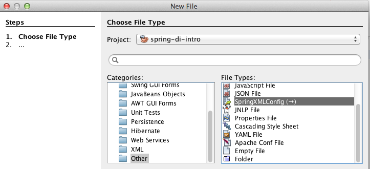
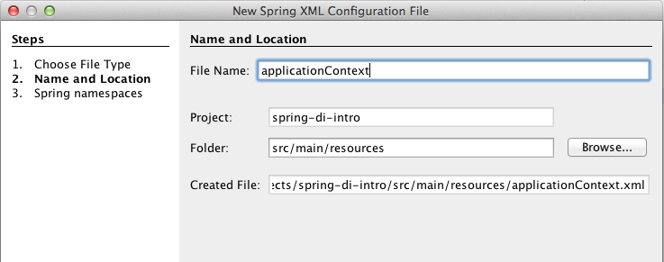

##Escuela Colombiana de Ingeniería

###Arquitecturas de Software - ARSW

##Taller – Principio de Inversión de dependencias, Inversión de Control, Contenedores Livianos e Inyección de dependencias.


Entregables:

-   Ejercicio básico, y un avance del ejercicio principal: antes de
    terminar la clase.

-   Nueva versión del diseño: Próximo martes, en clase (impreso o digital).

-   Solución completa: Próximo Miércoles, antes del siguiente laboratorio.

Parte I. Ejercicio básico.

1.  Clone el proyecto
    <https://github.com/hectorateci/spring-dependencyinjectionexercise-base.git>
    e impórtelo en Netbeans.

2.  Agregue como dependencia de Maven el artefacto ‘spring-context’:

	-   GROUP-ID:org.spring-framework
	-   ARTIFACT-ID: spring-context
	-   VERSION: 4.2.4-RELEASE

	Nota: Con Netbeans puede usar el asistente de búsqueda del repositorio central de Maven:

	
	
  
3.  Verifique que esta nueva dependencia, junto con sus respectivas
    dependencias, se hayan añadido y descargado:

    

4.  Cree un nuevo archivo de configuración de Spring. Aunque el nombre
    puede ser cualquiera, por convención este archivo suele
    llamarse ‘applicationContext.xml’. Como se está usando Maven, dicho
    archivo debe ir en la ruta que por convención se usa para los
    archivos de configuración:

    
    
    
5.  En este paso se le pedirá indicar qué nombres de
    espacio (namespaces) XML se incluirán en el archivo
    de configuración. Como por ahora sólo se usarán los elementos
    básicos, no es necesario incluir ninguno:

    

6.  Edite el archivo de configuración de Spring. Primero, defina dos
    beans: uno correspondiente al corrector ortográfico en español, y
    otro al corrector ortográfico en inglés. Para esto, use las opciones
    de autocompletar para los tags (Ctrl+espacio) y para la selección de la clase:

    

7.  En el mismo archivo agregue un bean correspondiente al
    corrector gramatical. Este bean, a diferencia de los dos anteriores,
    tiene una dependencia a algo de tipo *SpellChecker* llamada
    ‘sc’ (getSc/setSc) que debe ser inyectada, para lo cual se le agrega
    un elemento ‘property’ con el atributo ‘name’ asociado al nombre de
    la propiedad, y con el atributo ‘ref’, que indica qué bean se le
    inyectará a dicha propiedad. Deje la configuración de manera que se
    use el corrector ortográfico para español.

    

8.  Haga un programa de prueba, donde se cree una instancia de
    GrammarChecker mediante Spring, y se haga uso de la misma.

	```java
	
	public static void main(String[] args) {
		ApplicationContext ac=new ClassPathXmlApplicationContext("applicationContext.xml");
		GrammarChecker gc=ac.getBean(GrammarChecker.class);
		System.out.println(gc.check("la la la "));
	}
	```

9.  Modifique el archivo de configuración de Spring para que el Bean
    ‘grammarChecker‘ ahora haga uso de la clase SpanishSpellChecker (para
    que a GrammarChecker se le inyecte *EnglishSpellChecker* en lugar de
    *SpanishSpellChecker*. Verifique el nuevo resultado.

##Parte II.

En este repositorio se encuentra una versión muy rudimentaria del editor de texto *Guord for dummies*. Este editor de texto, como su nombre lo indica, está orientado a personas inexpertas en el uso de tecnología, y cuenta como principal elemento el no requerir interactuar con un sistema de archivos (todos los documentos se guardan en una ruta estándar).

Actualmente la aplicación hace uso del API de serialización de Java para hacer persistentes y reconstruir los documentos (en una ruta estándar desconocida por el usuario), y de la clase File para obtener el listado de los documentos creados en la misma (para cuando el usuario solicite abrir uno de los archivos).

Cuando el usuario ha digitado su texto, y al seleccionar la opción de guardar, la aplicación sólo le pregunta el nombre del documento, mas no en qué ruta lo hará. La aplicación se encarga de mantener oculto este detalle, y simplemente, cuando el usuario selecciona la opción de ‘abrir’, ésta le muestra el listado de documentos previamente guardados.

Como todo buen editor de texto, esta herramienta busca integrar algunos recursos léxicos para asistir en la auto-corrección de errores tipográficos u ortográficos. Por ahora, la aplicación hace uso de la clase TypoSuggestionsEngine, la cual contiene un conjunto estático de equivalencias de palabras.

El modelo de clases de la aplicación, por lo tanto, por ahora se reduce a:


Ejercicio.

Se le ha pedido que revise la aplicación y haga con la misma un ejericicio de ‘refactoring’, ya que ésta claramente no considera una arquitectura por capas, lo que dificultará en el futuro el mantenimiento de la misma. En particular se le ha pedido. 

* Ajustar la interfaz de la aplicación para que el usuario pueda escoger el idioma en el cual quiere se hagan las correcciones.

* Rediseñar la aplicación de manera que en la misma se puedan identificar claramente capas de presentación, lógica y persistencia. Utilice las [convenciones de Java para el nombramiento de paquetes](http://www.oracle.com/technetwork/java/codeconventions-135099.html) para que las clases correspondientes a cada capa queden en paquetes separados.

* Hacer los ajustes que hagan falta para que, además del mecanismo de persistencia mediante serialización, sea fácil incorporar nuevos mecanismos (en caso de que la serialización resulte obsoleta o ineficiente). Por ahora, se quere incorporar un esquema alternativo de persistencia basado en el almacenamiento del documento como texto plano.

* Hacer los ajustes que hagan falta para hacer fácil la adaptación de nuevos mecanismos de corrección automática de errores tipográficos/ortográficos. Por ahora se espera que se pueda elegir entre el existente (que hace uso de datos estáticos), y uno alternativo que haga uso de una base de datos -en línea- de errores tipográficos (los cuales son contínuamente actualizados):

	* Inglés:
	http://190.24.150.86/hcadavid/lang/eng_misspellings.txt
	
	* Español:
	http://190.24.150.86/hcadavid/lang/spa_misspellings.txt

	Para este último no olvide tener en cuenta que, como es necesario leer una gran cantidad de datos, para evitar problemas de latencia ésto se debería hacer una única vez, y luego almacenarlos en memoria en una estructura de datos que tenga una complejidad temporal logarítmica para la búsqueda de elementos.


Con lo anterior, se quiere que la aplicación se pueda configurar para funcionar bajo dos esquemas:

-   Offline: usando el conjunto de datos de errores ‘estático’.

-   Online: usando las palabras disponibles en las base de datos en línea.

Por otro lado, para el segundo esquema anterior (online), se quiere poder configurar una de dos variantes de cómo se sustituyen los errores:

-   Sustitución limpia: cuando se ingresa una palabra equivocada que tenga más de una opción correcta en la base de datos, se sustituye por la primera.
-   Sustitución invasiva: cuando se ingresa una palabra equivocada que tenga más de una opción correcta en la base de datos, se sustituye por una una cadena que alerte al escritor sobre las diferentes opciones. Por ejemplo, si se escribe *archeaologist*, en el texto se pondrá *[archeologist/archaeologist]*

####Tenga también en cuenta:

* Parámetros como las rutas donde por defecto se tendrán los documents, URLs de servidores y demás, NO deben estar ‘quemadas’ en el código. En lugar de esto, las mismas deberían ser inyectadas.
* Para lograr un código 'limpio', se debe evitar el hacer uso del contexto de Spring en muchos puntos del programa. Lo ideal es tener un único punto de creación (getBean), y que sólo con éste se desencadenen automáticamente todas las inyecciones de dependencias requeridas. 


##Criterios de evaluación

1. Funcionalidad. La aplicación debe poderse configurar para
	* Usar un formato basado en cadenas serializadas, o uno basado en texto plano.
	* Funcionar con la base de datos de errores local.
	* Funcionar con las bases de datos de errores en línea, y cuando éste sea el caso, definir si se hará una sustitución limpia o invasiva.
2. La solución debe quedar abierta para extensión y cerrada para modificación. Es decir, debe permitir (sólo creando nuevos Beans y ajustando la inyección de dependencias donde corresponda):
	* Agregar nuevos esquemas de persistencia.
	* Agregar nuevas fuentes de datos de errores.
	* Agregar nuevos formatos para la sustitución de errores adicionales a los ya existentes (invasivo, limpio). 
	
3. Diseño de la solución:
	* El diseño debe permitir un único punto de creación de Beans.
	* El diseño debe considerar que las estrategias de sustitución sólo se tendrán en cuenta cuando se haga uso de las bases de datos de errores en línea.
